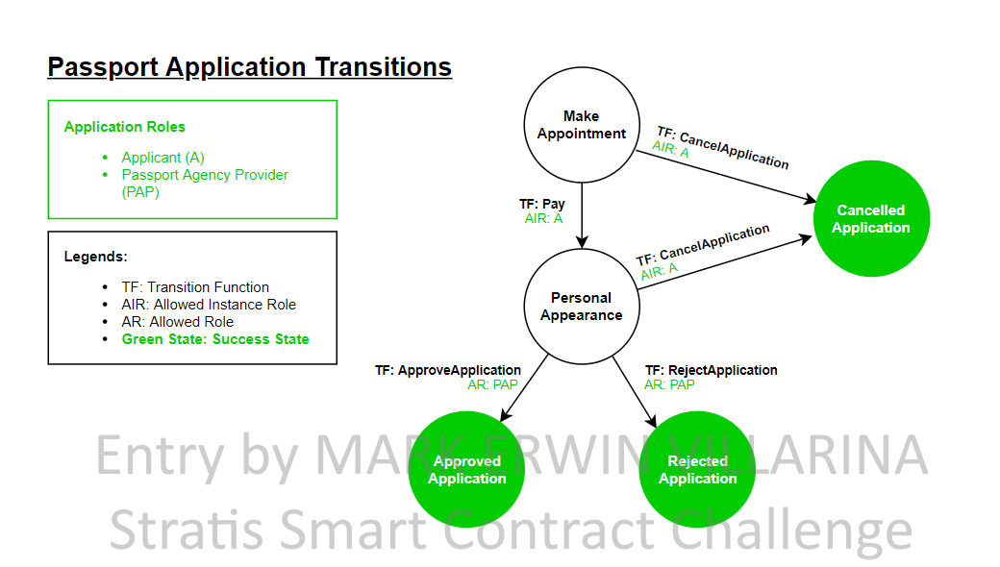

Passport Application Smart Contract
==============================

Overview 
---------

The Passport Application Smart Contract expresses a workflow for applying/renewing  of passport 
that suppports online payment. The state transition diagram below shows the
interactions among the states in this workflow. 

Application Roles 
------------------

| Name                   | Description                                       |
|------------------------|---------------------------------------------------|
| Provider 				 | A government organization that responsible for issuance of the passport |
| Applicant    			 | The individual whom needs a passport |

States 
-------

| Name                   | Description                                       |
|------------------------|---------------------------------------------------|
|MakeAppointment 		 | Indicates that the applicant did make an appointment for passport application/renewal |
|PersonalAppearance 	 | Indicates that the applicant should visit the passport agency office for personal appearance.|
|CancelledApplication 	 | Indicates that the applicant have cancelled his/her application.|
|ApprovedApplication 	 | Indicates that the applicant passport application has been approved by the provider |
|RejectedApplication 	 | Indicates that the applicant passport application has been rejected by the provider |

Workflow Details
----------------

An instance of the Passport Application Smart Contract's workflow starts in the:

<b>MakeAppointment</b> state when an applicant successfully select an appointment schedule and filled up an online application form. 

The state changes to <b>PersonalAppearance</b> when the applicant paid the application fee. The application fee is currently set to <b>80 CRS</b>. The smart contract will hold the payment until the state set either to <b>ApprovedApplication</b>, <b>RejectedApplication</b>, or <b>CancelledApplication</b>.

The applicant have a chance to cancel his/her appointment when the cuurent state is <b>MakeAppointment</b> 
or <b>PersonalAppearance</b> but there is a penalty of <b>8 CRS</b>. After cancelling an appointment, 
the applicant will only receive <b>72 CRS</b>, the provider will receive the <b>8 CRS</b> and 
the state will be set to <b>CancelledApplication</b>

When the state is in <b>PersonalAppearance</b>, the provider/passport government agency could approve an appointment. 
If the provider approves the application, the payment will transfer to the provider address and the state 
will set to <b>ApprovedApplication</b>.

When the state is in <b>PersonalAppearance</b>, the provider/passport government agency could reject an appointment. 
If the provider rejects the application, the provider will receive <b>8 CRS</b> as an appointment fee and the applicant will only receive <b>72 CRS</b>,
 the payment will transfer to the provider address and the state will set to <b>ApprovedApplication</b>.

An instance of the Basic Provenance application's workflow starts in the Created
state when an owner wants to begin a process for tracking ownership or
responsibility.  An owner is also the InitiatingCounterParty since the owner
initiates the process for tracking the ownership or responsibility.  The state
changes to InTransit whenever a new counterparty that can take on the
responsibility is identified.  The owner in the InitiatingCounterParty role
calls a function to transfer responsibility by specifying a counterparty.  Upon
reaching the InTransit state, the counterparty can transfer the responsibility
to another counterparty or the owner can decide to complete the transfers of
responsibility and call the Complete function to reach the Completed state. 

The happy path shown in the transition diagram traces the owner transferring
responsibility to a counterparty once and then completing the workflow. 

Application Files
-----------------
[PassportApplication.cs](./PassportApplicationContract/PassportApplication.cs)
